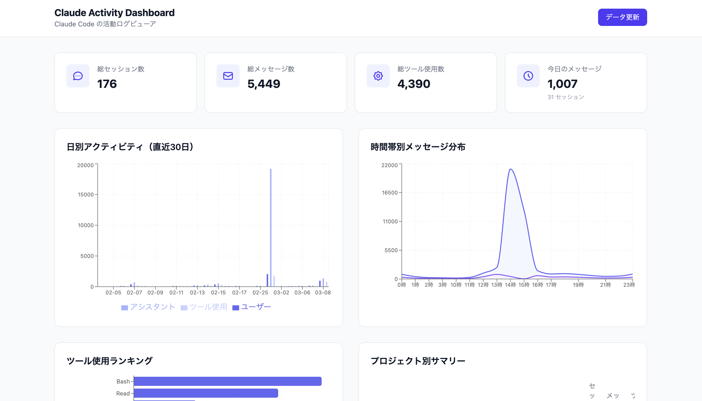

# claude-activity-dashboard

Claude Code の活動ログ（`~/.claude/projects/` 内の JSONL）を SQLite に取り込み、ブラウザで閲覧・分析するダッシュボード。



## アーキテクチャ

```
~/.claude/projects/**/*.jsonl
        │
        ▼
   ingest.py ──► SQLite (data/claude_activity.db)
        │
        ▼
   Datasette (JSON API, port 8765)
        │
        ▼
   React + Vite (フロントエンド)
```

- **バックエンド**: Datasette が SQLite を JSON API として公開
- **フロントエンド**: React + TypeScript + Tailwind CSS + Recharts

## セットアップ

```bash
make setup
```

Python 3.11+ と Node.js が必要です。

## 起動

### 開発モード（API + フロントエンド）

```bash
make dev
```

- Datasette API: http://localhost:8765
- Vite dev server: http://localhost:5173 （API は Datasette にプロキシ）

### Datasette のみ

```bash
make serve
```

http://localhost:8765 でダッシュボードが開きます。

## データ更新

```bash
make ingest
```

`~/.claude/projects/` 配下の全 JSONL ファイルを読み取り、SQLite に取り込みます。

ブラウザからは `/-/refresh` にアクセスして「更新実行」ボタンでも実行できます。

## ダッシュボード機能

### 概要画面 (`/`)

- **統計カード**: 総セッション数、メッセージ数、ツール使用回数、アクティブプロジェクト数
- **日別アクティビティチャート**: 日ごとのセッション数・メッセージ数の推移
- **時間帯別分布チャート**: 何時に Claude Code を使っているか
- **ツール使用ランキング**: どのツール（Bash, Read, Edit 等）が多く使われているか
- **プロジェクト別サマリー**: プロジェクトごとの利用状況
- **最近のセッション一覧**: 直近のセッションへのリンク

### セッション詳細画面 (`/#/sessions/:id`)

- セッションのメタ情報（プロジェクト名、開始/終了時刻、メッセージ数、ツール使用回数）
- メッセージ一覧（ユーザー / アシスタントの全文表示）
- ツール使用の詳細（ツール名 + 入力パラメータ）

## 活動ログ分析スキル (`/analyze-usage`)

Claude Code のスキルとして、活動ログの分析と改善提案を行えます。このリポジトリを clone した人は自動的に利用可能です。

```bash
# Claude Code 上で実行
/analyze-usage              # 全期間分析
/analyze-usage 直近7日      # 直近7日間のみ
/analyze-usage dotfiles     # プロジェクト名でフィルタ
```

### 分析内容

| カテゴリ | 内容 |
|----------|------|
| ツール効率 | Bash で実行されたが専用ツールで代替可能なコマンド、同一ツール連続使用、頻度分布 |
| 指示パターン | 繰り返し指示の検出、頻出キーワードの自動抽出 |
| エラーパターン | 修正・やり直し指示、否定表現を含む意図ズレ指示 |
| プロジェクト横断 | プロジェクト別のツール/メッセージ比率 |
| セッション効率 | 長時間セッション TOP10、時間帯別活動量 |

### 改善提案の自動生成

分析結果を基に以下の3観点で改善提案を生成し、ユーザーが選択した提案を自動反映します：

- **CLAUDE.md への追加推奨** — ルールの追加テキストを提案・反映
- **新規スキル候補** — 繰り返し操作のスキル化を提案・作成
- **プロンプト改善** — Claude 側の振る舞いルールとして CLAUDE.md に反映

### 構成

- `analyze.py` — 全分析クエリを実行し JSON で出力するスクリプト
- `.claude/skills/analyze-usage/SKILL.md` — スキル定義（手順・レポート形式・提案テンプレート）

## テスト

```bash
# Python テスト
make setup  # 初回のみ
.venv/bin/pytest

# フロントエンドテスト
cd frontend && npm test
```

## プロジェクト構成

```
├── analyze.py          # 活動ログ分析スクリプト（JSON 出力）
├── ingest.py           # JSONL → SQLite 取り込みスクリプト
├── metadata.yml        # Datasette 設定（SQL クエリ定義）
├── plugins/
│   └── refresh.py      # Datasette プラグイン（ブラウザからデータ更新）
├── frontend/
│   └── src/
│       ├── pages/          # Dashboard, SessionDetail
│       ├── components/     # チャート、テーブル等のコンポーネント
│       ├── hooks/          # useQuery（Datasette API 呼び出し）
│       └── types/          # TypeScript 型定義
├── tests/              # Python テスト
├── .claude/skills/     # Claude Code スキル定義
│   └── analyze-usage/  # /analyze-usage スキル
├── data/               # SQLite DB（生成物）
└── Makefile
```
